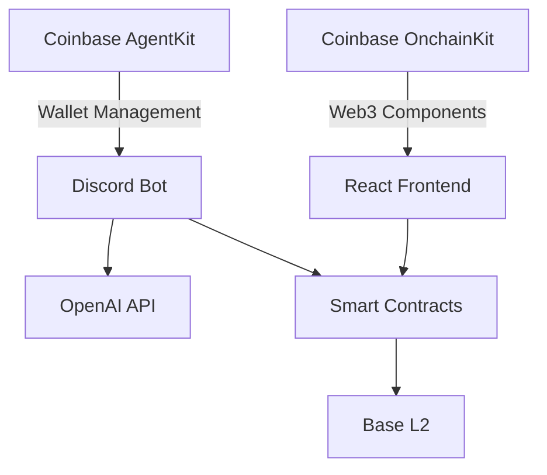

# The First AI-Powered Play-to-Earn Token: Trivia Token Bot

> Built for ETHGlobal's "Agentic Ethereum" Hackathon 2025, leveraging Coinbase's AgentKit, OnchainKit, and the Base blockchain.

## Project Objective
Create the world's first AI-powered play-to-earn token through a Discord bot that rewards correct open-answer trivia responses with ERC-20 tokens on Base blockchain. The project features:
- Automated question generation and user-friendly answer validation using GPT-4o-mini
- Token economics with transaction taxes and staking requirements
- React-based staking interface powered by Coinbase OnchainKit
- Secure wallet integration via Coinbase AgentKit
- 7-day vesting period for earned tokens
- Seamless deployment on Base, Coinbase's Ethereum L2

## Token Economics
- Total Supply: 1,000,000,000 $TRIVIA tokens (1 billion)
- Initial Distribution:
  * 45% Pre-sale (Release Schedule):
    - Day 1: 20% (200M tokens)
    - Day 31: 12.5% (125M tokens)
    - Day 61: 12.5% (125M tokens)
  * 45% Marketing & Liquidity:
    - 25% Marketing/Buyback Fund
    - 10% DEX Liquidity
    - 10% Airdrops
  * 10% Staking Rewards Pool
- Staking APY Schedule:
  * Months 1-3: 400% APY
  * Months 4-6: 250% APY
  * Months 7-12: 200% APY
- Reward Structure:
  * Hard questions: 10 $TRIVIA tokens
  * Easy questions: 5 $TRIVIA tokens
  * Borderline answers: 50% of normal reward
- Transaction Tax: 2% collected by treasury wallet
- Server Access: Discord server owners must stake 100,000 $TRIVIA tokens (0.01% of supply) to use the bot
- Vesting: 7-day lock period on earned tokens before transfer/trade

## Architecture Overview


## Tech Stack & Dependencies
**Coinbase Integration**
- AgentKit ^0.2.1 (Secure wallet management)
- OnchainKit (Web3 frontend components)
- Base (Ethereum L2 blockchain)

**Smart Contracts**
- Hardhat ^2.22.0
- @openzeppelin/contracts ^5.0.1
- @nomicfoundation/hardhat-verify ^3.0.0

**Discord Bot**
- TypeScript 5.3.3
- discord.js ^14.15.3
- openai ^4.40.1

**Frontend**
- React 18.2.0
- ethers.js ^6.11.0
- web3-react ^8.2.3

## Getting Started

### 1. Smart Contract Setup
```bash
npm install --save-dev hardhat @nomicfoundation/hardhat-toolbox
npx hardhat init
```

### 2. Bot Configuration
```typescript
// src/config.ts
export const CONFIG = {
  OPENAI_KEY: process.env.OPENAI_API_KEY,
  DISCORD_TOKEN: process.env.BOT_TOKEN,
  CONTRACT_ADDRESS: '0x...',
  TAX_RATE: 200, // 2% in basis points
  LOCK_PERIOD: 604800, // 7 days in seconds
  REWARD_AMOUNTS: {
    HARD: 10,
    EASY: 5
  }
};
```

### 3. Frontend Installation
```bash
cd frontend
npm install
npm run dev
```

## Core Implementation Details

### User-Friendly Answer Validation
```typescript
async function validateResponse(question: string, answer: string): Promise<ValidationResult> {
  const prompt = `Act as a consistent and fair trivia expert. Evaluate if this answer correctly addresses the question.
  Give benefit of doubt to borderline answers. Consider partial credit for almost-correct answers.
  
  Question: ${question}
  Answer: ${answer}
  
  Respond ONLY with one of: "CORRECT", "BORDERLINE", or "INCORRECT"`;
  
  const response = await openai.chat.completions.create({
    model: "gpt-4o-mini",
    messages: [{ role: "user", content: prompt }],
    temperature: 0.1
  });

  return response.choices[0].message.content?.trim();
}
```

### Token Lock Mechanism
```solidity
// contracts/TriviaToken.sol
mapping(address => uint256) private _lockTimestamps;

function transfer(address recipient, uint256 amount) public override returns (bool) {
    require(block.timestamp >= _lockTimestamps[msg.sender], "Tokens locked");
    return super.transfer(recipient, amount);
}
```

## User Flow
1. Server owner stakes $TRIVIA tokens to enable bot
2. Users register their wallet address with bot
3. Bot generates questions in Discord server
4. Users submit answers in chat
5. AI validates answers and assigns rewards
6. Tokens are automatically sent to user's wallet (subject to 7-day vesting)
7. Users can view balances in their wallets and vesting schedule via bot commands

## Security Model
The project adopts a trust-based approach focusing on user experience:
- Server staking requirement as primary anti-abuse measure
- Simple treasury management through designated wallet
- Trust-based answer validation system
- Focus on community engagement over strict security measures

## Scalability
- One active trivia session per Discord server
- Multiple concurrent servers supported
- Base blockchain integration with future network flexibility
- Pay-as-we-grow approach to API scaling

## Contributing
1. Clone repository
2. Create feature branch
3. Submit PR with:
   - Test coverage
   - Updated documentation
   - Security audit checklist

## Known Limitations & Future Improvements
- Concurrent Server Management: The current implementation handles multiple Discord servers without server-specific queuing systems
- No Anti-farming Mechanisms: Users can potentially create multiple Discord accounts
- Base L2 Dependency: System operations may be affected by Base network conditions
- Trust-based Wallet Registration: No verification of wallet ownership during registration
- No Dispute Resolution: AI validation results are final and cannot be disputed
- Simple Treasury Management: Single wallet implementation for hackathon purposes
